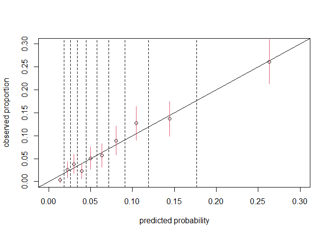
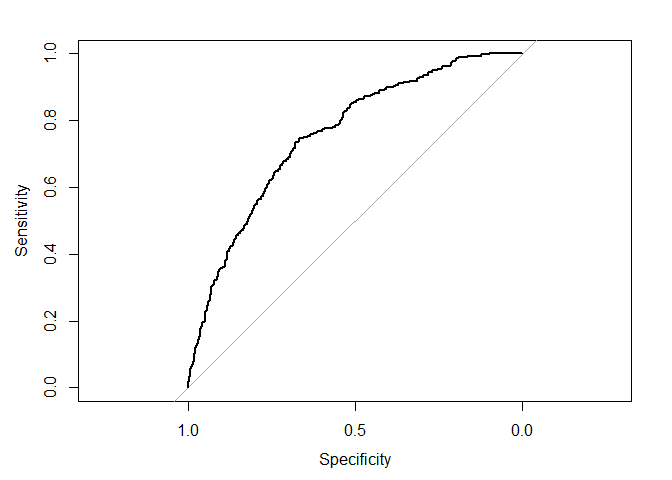
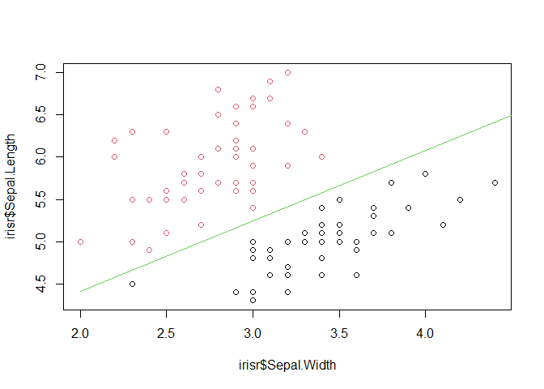

Week 6-Binary response
================
Li-Hsin Chien
2026-04-02

### Model fitting

``` r
library(faraway)

wcgs$bmi <- with(wcgs, 703*wcgs$weight/(wcgs$height^2))
lmod <- glm(chd ~ age + height + weight +bmi + sdp + dbp + chol + dibep + cigs +arcus, family=binomial, wcgs)
lmodr <- step(lmod, trace=0)
summary(lmodr)
```

    ## 
    ## Call:
    ## glm(formula = chd ~ age + height + bmi + sdp + chol + dibep + 
    ##     cigs + arcus, family = binomial, data = wcgs)
    ## 
    ## Coefficients:
    ##                Estimate Std. Error z value Pr(>|z|)    
    ## (Intercept)  -15.299983   2.294134  -6.669 2.57e-11 ***
    ## age            0.061590   0.012397   4.968 6.76e-07 ***
    ## height         0.050161   0.027824   1.803   0.0714 .  
    ## bmi            0.060385   0.026599   2.270   0.0232 *  
    ## sdp            0.017728   0.004155   4.267 1.98e-05 ***
    ## chol           0.010709   0.001529   7.006 2.45e-12 ***
    ## dibepB        -0.657616   0.145898  -4.507 6.56e-06 ***
    ## cigs           0.021041   0.004262   4.936 7.96e-07 ***
    ## arcuspresent   0.210998   0.143718   1.468   0.1421    
    ## ---
    ## Signif. codes:  0 '***' 0.001 '**' 0.01 '*' 0.05 '.' 0.1 ' ' 1
    ## 
    ## (Dispersion parameter for binomial family taken to be 1)
    ## 
    ##     Null deviance: 1769.2  on 3139  degrees of freedom
    ## Residual deviance: 1569.3  on 3131  degrees of freedom
    ##   (14 observations deleted due to missingness)
    ## AIC: 1587.3
    ## 
    ## Number of Fisher Scoring iterations: 6

### Prediction

 \sim N(0, I^{-1}(\beta))")

)")

x_0)")

%")
CI for
:

,~~~\text{where } \hat{\eta}_L=\hat{\eta} - z^{\alpha/2} se(\hat{\eta}),~~~ \hat{\eta}_U=\hat{\eta} + z^{\alpha/2} se(\hat{\eta}), ~~~ se(\hat{\eta})=\frac{1}{n}  x_0 ^T I^{-1}(\hat{\beta} )x_0")


%")
CI for
:

")

``` r
x.s<-as.matrix(model.matrix(lmodr))
apply(x.s, 2, median)
```

    ##  (Intercept)          age       height          bmi          sdp         chol 
    ##       1.0000      45.0000      70.0000      24.3898     126.0000     223.0000 
    ##       dibepB         cigs arcuspresent 
    ##       0.0000       0.0000       0.0000

``` r
new_data <- data.frame(
  age = 45,
  height = 70,
  bmi = 24.4,
  sdp = 126,
  chol = 223,
  dibep = factor("A", levels = levels(wcgs$dibep)),
  cigs = 0,
  arcus = factor("absent", levels = levels(wcgs$arcus))
)

xb.pred<-predict(lmodr,new_data,se.fit =T) #predict x*beta, se

predict(lmodr,new_data,se.fit =T, type="response") #predict p, se
```

    ## $fit
    ##          1 
    ## 0.05108088 
    ## 
    ## $se.fit
    ##           1 
    ## 0.006569112 
    ## 
    ## $residual.scale
    ## [1] 1

``` r
(xb.pred.ci<-xb.pred$fit + c(-1,1)*1.96*xb.pred$se.fit)
```

    ## [1] -3.187542 -2.656284

``` r
(p.pred <- exp(xb.pred$fit)/(1+exp(xb.pred$fit)))
```

    ##          1 
    ## 0.05108088

``` r
exp(xb.pred.ci)/(1+exp(xb.pred.ci))
```

    ## [1] 0.03963724 0.06560273

``` r
predict(lmodr,new_data,se.fit =T, type="response")
```

    ## $fit
    ##          1 
    ## 0.05108088 
    ## 
    ## $se.fit
    ##           1 
    ## 0.006569112 
    ## 
    ## $residual.scale
    ## [1] 1

### Goodness of Fit (section 2.6)

#### Calibration

1.  Data Preparation and Ordering: The script begins by extracting the
    predicted probabilities
    ()
    and the actual binary outcomes
    ()
    from the fitted logistic model lmodr. Both the probabilities and the
    corresponding outcomes are then sorted in ascending order based on
    the predicted probability values.


2.  Grouping (e.g., partitioning into 10 Bins) Calculates the thresholds
    (10th, 20th, …, 100th percentiles) of the predicted probabilities.
    It then categorizes the sorted probabilities into 10 distinct groups
    (bins) using these quantiles as breakpoints. The predicted
    probabilities
    
    and the corresponding observed outcome
     in bin
     are:

,~~~ i=1,...,n_j,~~~ j=1,...,10")

3.  Calculating Bin Statistics: For each of the 10 bins, the following
    aggregate metrics are computed:

- Mean Predicted Probability: The average predicted value within the bin

  
- Observed Proportion & sd : The actual fraction of positive events
  within the bin.


 =\sqrt{\frac{\bar{y}_j (1-\bar{y}_j)}{n_j}},~~~ j=1,...,10")

 ,~~~ j=1,...,10")

``` r
# Data Preparation and Ordering
pred.prob <- predict(lmodr, type="response")
y<-  lmodr$y

pred.prob.o<-sort(pred.prob)
y.o<-y[order(pred.prob)]

# Grouping
(quantile.p<-quantile(pred.prob.o, (1:10)/10))
```

    ##        10%        20%        30%        40%        50%        60%        70% 
    ## 0.01806538 0.02614876 0.03429338 0.04458150 0.05731947 0.07158794 0.09100040 
    ##        80%        90%       100% 
    ## 0.11926466 0.17638819 0.91022455

``` r
group<-cut(pred.prob.o, breaks=c(0,quantile.p))

# Calculating Bin Statistics
x.c<-tapply(pred.prob.o, group ,mean) # mean predicted probability
y.c<-tapply(y.o, group, mean)        # observed proportion
bin.count<-tapply(y.o, group, length)# bin count:number of observations in each bin
y.sd <- sqrt(y.c*(1-y.c)/bin.count)  # sd(y_hat)
ci.u<-y.c+1.96*y.sd                  # CI
ci.l<-y.c-1.96*y.sd

plot(x.c,y.c,xlab="predicted probability",ylab="observed proportion",ylim=c(0,.3),xlim=c(0,.3))
abline(0,1)
apply(as.matrix(quantile.p),2,function(x) abline(v=x, lty=2))
```

    ## NULL

``` r
apply(cbind(x.c,ci.u,ci.l),1,function(x) segments(x[1],x[2],x[1],x[3],col=2))
```

<!-- -->

    ## NULL

#### Discrimination

Given a cutoff , if
"),
let
")

-Sensitivity:


-Specificity:


ROC curve:

- x axis: Sensitivity
- y axis: 1-Specificity

``` r
#install.packages("pROC")
library(pROC)
```

    ## Type 'citation("pROC")' for a citation.

    ## 
    ## Attaching package: 'pROC'

    ## The following objects are masked from 'package:stats':
    ## 
    ##     cov, smooth, var

``` r
#y<-  ifelse(wcgsm$chd == "no",0,1)

roc.lmod<-roc(y,pred.prob)
```

    ## Setting levels: control = 0, case = 1

    ## Setting direction: controls < cases

``` r
auc(roc.lmod)
```

    ## Area under the curve: 0.7553

``` r
plot(roc.lmod)
```

<!-- -->

### Estimation Problem (Section 2.7)

We take a subset of the famous Fisher Iris data to consider only two of
the three species of Iris and use only two of the potential predictors:

``` r
library(dplyr)
```

    ## 
    ## Attaching package: 'dplyr'

    ## The following objects are masked from 'package:stats':
    ## 
    ##     filter, lag

    ## The following objects are masked from 'package:base':
    ## 
    ##     intersect, setdiff, setequal, union

``` r
irisr <- filter(iris, Species != "virginica") %>%  select(Sepal.Width, Sepal.Length,Species)

irisr <- iris[iris$Species != "virginica",c(1,2,5)]

plot(irisr$Sepal.Width, irisr$Sepal.Length, col=irisr$Species)
lmod <- glm(Species ~ Sepal.Width + Sepal.Length, family=binomial, irisr)
```

    ## Warning: glm.fit: algorithm did not converge

    ## Warning: glm.fit: fitted probabilities numerically 0 or 1 occurred

``` r
tmp<-lmod$coefficients
x<-c(2,5)
y<-(-tmp[1]-x*tmp[2])/tmp[3]
points(x,y,type="l",col=3)
```

<!-- -->

Two Species of iris can be perfectly separated by sepal length and
width. We see that there were problems with the convergence.

``` r
lmod <- glm(Species ~ Sepal.Width + Sepal.Length, family=binomial, irisr)
```

    ## Warning: glm.fit: algorithm did not converge

    ## Warning: glm.fit: fitted probabilities numerically 0 or 1 occurred

``` r
summary(lmod)
```

    ## 
    ## Call:
    ## glm(formula = Species ~ Sepal.Width + Sepal.Length, family = binomial, 
    ##     data = irisr)
    ## 
    ## Coefficients:
    ##              Estimate Std. Error z value Pr(>|z|)
    ## (Intercept)    -360.6   195972.9  -0.002    0.999
    ## Sepal.Width    -110.1    55361.5  -0.002    0.998
    ## Sepal.Length    131.8    64577.0   0.002    0.998
    ## 
    ## (Dispersion parameter for binomial family taken to be 1)
    ## 
    ##     Null deviance: 1.3863e+02  on 99  degrees of freedom
    ## Residual deviance: 7.1185e-09  on 97  degrees of freedom
    ## AIC: 6
    ## 
    ## Number of Fisher Scoring iterations: 25

Notice that the residual deviance is zero, indicating a perfect fit
where the likelihood is equivalent to the saturated model. However, none
of the predictors are significant due to the high standard errors.

The line is computed by using the fitted model, we add the line
corresponding to


For the data, we suffer from an “embarrassment of riches”. Whether the
data is effective depends on the purpose of analysis:

-For prediction or classification purpose: useful

-For parameter estimation: not so useful
